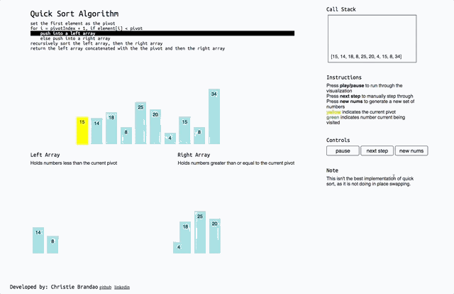

# Quick Sorted Animated

## Overview
A visual representation of how quick sort works.

## Preview

## Features
* Create a random unsorted set of numbers
* Start the visualization of the quick sort to play through on its own or manually step through yourself
* Psuedocode highlighted according to where the visualization is
* Call stack updates according to where the visualization is

## Technologies
* JavaScript for sorting logic
* React for frontend
* lodash for random number set generation
