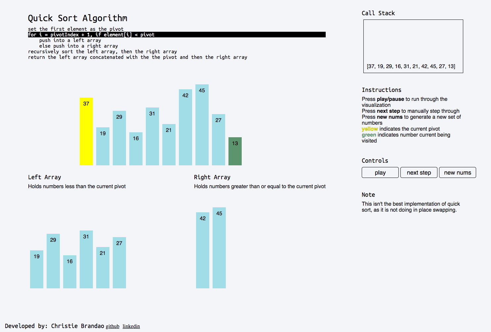

# Quick Sorted Animated

[Live Link](https://quick-sort-animated.herokuapp.com/)

## Overview
A visual representation of a recursive quicksort algorithm implementation. 
The implementation being visualized is not the optimal implementation of quicksort
as it is not doing in place swapping.

## Preview

## Features
* Create a random unsorted set of numbers
* Start the visualization of the quick sort to play through on its own or manually step through yourself
* Psuedocode highlighted according to where the visualization is
* Call stack updates according to where the visualization is

## Technologies
* JavaScript for sorting logic
* React for frontend
* lodash for random number set generation

## Future Features
* Allow for adjustment of speed for the auto-playing
* Add more sorting algorithms